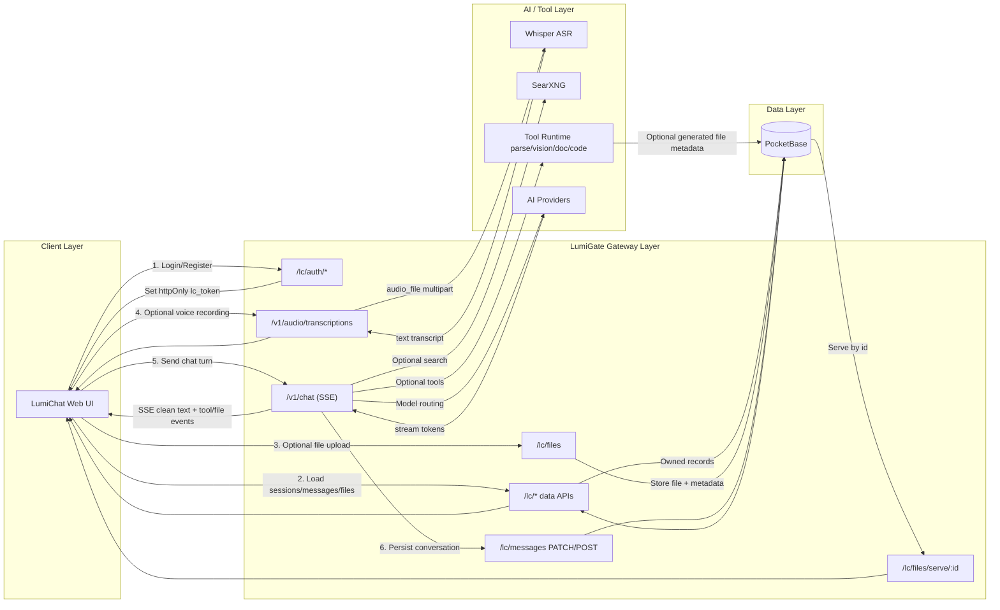
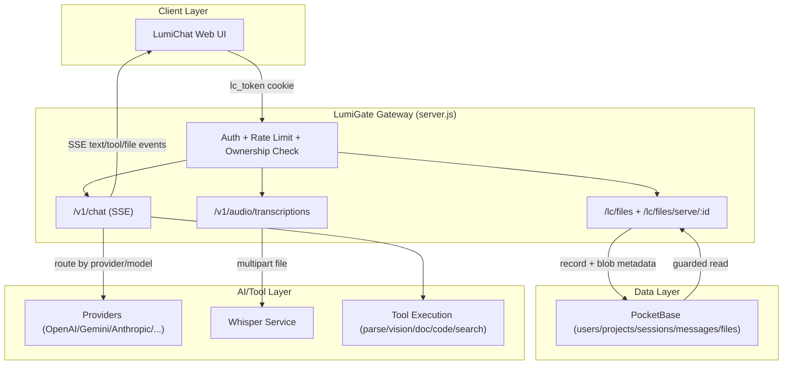

# LumiGate

Self-hosted AI Agent Platform. One endpoint, 8 providers, server-side tool execution, enterprise auth.

## Quick Start

```bash
git clone https://github.com/richardhxwang/lumigate.git && cd lumigate
cp .env.example .env   # add your API keys
docker compose up -d --build
```

Dashboard at `http://localhost:9471`. Chat UI at `http://localhost:9471/lumichat.html`.

Integrated local services started by default:
- PocketBase: `http://localhost:8090`
- Whisper STT: `http://localhost:17863`

First-time PocketBase bootstrap:
1. Open `http://localhost:8090/_/`.
2. Create the first superuser.
3. Put the same credentials into `.env` as `PB_ADMIN_EMAIL` and `PB_ADMIN_PASSWORD` (required for admin-tier and subscription actions in LumiGate).

## What is LumiGate

LumiGate is a unified AI gateway that sits between your apps and 8 AI providers. Send a single `POST /v1/chat` request — the server handles provider routing, web search, file generation, and tool execution. Clients only receive clean text and download events. No tool logic on the frontend.

Ships with LumiChat, a production chat UI with SSE streaming, PocketBase auth, file attachments, voice input, and dark/light mode.

Runs on a NAS, mini PC, or any Docker host.

## Architecture



<details><summary>Text-based architecture (for renderers without Mermaid support)</summary>

```
┌──────────┐                ┌──────────────────────────────┐
│ LumiChat │──cookie──▶     │        LumiGate Server       │
│ iOS App  │──HMAC────▶     │                              │
│ Any App  │──Token───▶     │  /v1/chat → Auth → AI Proxy  │
└──────────┘                │    → Tool Execute → Clean SSE │
                            └──────┬────────┬────────┬─────┘
                                   │        │        │
                            ┌──────┴──┐ ┌───┴───┐ ┌──┴────────┐
                            │ 8 AI    │ │DocGen │ │PocketBase │
                            │Providers│ │SearXNG│ │(Auth/Data)│
                            └─────────┘ └───────┘ └───────────┘
```

</details>

### Current Integrated Architecture (LumiChat + LumiGate + PocketBase)

This is the current production data flow and trust boundary:

1. LumiChat (`/lumichat`) is a browser UI. It stores no PB credentials in JS; auth uses `lc_token` httpOnly cookie.
2. LumiGate (`server.js`) is the single backend gateway. It enforces auth/rate-limit, forwards user-scoped calls to PocketBase, and proxies AI provider traffic.
3. PocketBase is the system of record for LumiChat domain data: users, projects, sessions, messages, files, usage settings.
4. Ownership checks are enforced in gateway routes before write/read of sensitive records (`assertLcSessionOwned` / `assertRecordOwned`) and mapped to proper client status codes.
5. File flow: browser uploads multipart file to `POST /lc/files` -> LumiGate streams file to PocketBase `lc_files` -> browser consumes via guarded `GET /lc/files/serve/:id`.
6. Voice flow: browser records audio with `MediaRecorder` -> uploads as multipart `file` field to `/v1/audio/transcriptions` -> gateway audio route forwards to Whisper service -> transcript is inserted into chat input.
7. AI flow: UI sends chat to LumiGate (`/v1/chat`) -> provider routing/tool execution/search happens server-side -> SSE stream returns clean text + optional tool/file events.

Security boundaries in this architecture:

- Client never talks to PocketBase directly for privileged admin operations.
- PB token verification and row ownership happen on every gateway-mediated data operation.
- Unauthorized ownership access returns 4xx (forbidden/not found semantics), not masked 5xx.
- Uploads are constrained by multer limits and MIME/extension validation in domain routes.
- Admin and platform APIs use separate auth paths from LumiChat user auth.



## API

```bash
curl -N -X POST http://localhost:9471/v1/chat \
  -H "Content-Type: application/json" \
  -H "X-Project-Key: $KEY" \
  -d '{
    "provider": "deepseek",
    "model": "deepseek-chat",
    "messages": [{"role": "user", "content": "Generate Excel: quarterly sales"}],
    "stream": true
  }'
```

SSE response delivers three event types:

| Event | Purpose |
|-------|---------|
| `data` (default) | Clean text chunks — render directly |
| `event: tool_status` | Progress hints (e.g. "Generating Excel...") |
| `event: file_download` | File metadata — render as download card |

Optional fields: `web_search` (bool, auto-detected if omitted), `tools` (bool, default true).

### Auth Headers / Cookies

- Platform API: `X-Project-Key` (or HMAC/token flow).
- Admin API: `admin_token` cookie (or `X-Admin-Token`).
- LumiChat API: `lc_token` cookie.

### Complete API Reference

Source of truth is `server.js`; list below mirrors current routes.

#### Public / System

| Method | Path | Notes |
|---|---|---|
| GET | `/health` | Health + module/provider detail for admin |
| GET | `/providers` | Provider availability |
| GET | `/models/:provider` | Models for provider |
| GET | `/collector/health` | Collector runtime status |
| GET | `/` | Root page |
| GET | `/v1/sys/panel` | Hidden dashboard entry |
| GET | `/dashboard` | Disabled (204) |
| GET | `/chat` | Chat redirect/entry |
| GET | `/lumichat` | LumiChat entry |

#### Admin Auth / MFA

| Method | Path |
|---|---|
| POST | `/admin/login` |
| POST | `/admin/mfa/verify` |
| POST | `/admin/logout` |
| GET | `/admin/auth` |
| POST | `/admin/mfa/setup` |
| POST | `/admin/mfa/confirm` |
| DELETE | `/admin/mfa` |
| GET | `/admin/mfa/qr` |
| GET | `/admin/mfa/status` |
| GET | `/admin/uptime` |

#### Admin Control Plane

| Method | Path |
|---|---|
| GET | `/admin/test/:provider` |
| GET | `/admin/projects` |
| POST | `/admin/projects` |
| PUT | `/admin/projects/:name` |
| POST | `/admin/projects/:name/regenerate` |
| DELETE | `/admin/projects/:name` |
| GET | `/admin/rate` |
| GET | `/admin/usage` |
| GET | `/admin/usage/summary` |
| GET | `/admin/settings` |
| PUT | `/admin/settings` |
| GET | `/admin/lc/schema` |
| GET | `/admin/lc/trash` |
| POST | `/admin/lc/trash/restore` |
| GET | `/admin/lc/projects/:id/references` |
| POST | `/admin/lc/projects/:id/remap` |
| GET | `/admin/lc-users` |
| PATCH | `/admin/lc-users/:id/tier` |
| PATCH | `/admin/lc-users/:id/decline-upgrade` |
| GET | `/admin/lc-subscriptions` |
| POST | `/admin/lc-subscriptions` |
| POST | `/admin/key` |
| GET | `/admin/keys/cooldowns` |
| DELETE | `/admin/keys/cooldowns/:keyId` |
| GET | `/admin/keys/:provider` |
| POST | `/admin/keys/:provider` |
| PUT | `/admin/keys/:provider/reorder` |
| PUT | `/admin/keys/:provider/:keyId` |
| DELETE | `/admin/keys/:provider/:keyId` |
| GET | `/admin/collector/status` |
| POST | `/admin/collector/accounts/:provider` |
| PUT | `/admin/collector/accounts/:provider/:accountId` |
| DELETE | `/admin/collector/accounts/:provider/:accountId` |
| POST | `/admin/collector/login/:provider` |
| GET | `/admin/collector/login/status` |
| DELETE | `/admin/collector/login` |
| POST | `/admin/collector/restore` |
| PUT | `/admin/collector/token/:provider` |
| DELETE | `/admin/collector/token/:provider` |
| PUT | `/admin/providers/:name/access-mode` |
| GET | `/admin/users` |
| POST | `/admin/users` |
| PUT | `/admin/users/:username` |
| DELETE | `/admin/users/:username` |
| GET | `/admin/metrics` |
| GET | `/admin/audit` |
| POST | `/admin/backup` |
| GET | `/admin/backups` |
| POST | `/admin/restore/:name` |
| GET | `/admin/upgrade-requests` |
| POST | `/admin/upgrade-requests/:settingsId/approve` |
| POST | `/admin/upgrade-requests/:settingsId/reject` |

#### Gateway / Platform APIs

| Method | Path | Notes |
|---|---|---|
| POST | `/v1/chat` | Unified streaming chat API |
| POST | `/v1/tools/execute` | Server-side tool execution |
| POST | `/v1/token` | Ephemeral token issuance |
| POST | `/v1/otp/send` | OTP send |
| POST | `/v1/otp/verify` | OTP verify |

#### Domain APIs (Config-driven)

| Method | Path | Notes |
|---|---|---|
| GET | `/api/domains/:domain/schema` | Domain schema/capabilities |
| GET | `/api/domains/:domain/:collection` | Generic list/filter/sort |
| POST | `/api/domains/:domain/:collection` | Generic create |
| PATCH | `/api/domains/:domain/:collection/:id` | Generic update |
| DELETE | `/api/domains/:domain/:collection/:id` | Generic delete (soft/hard policy) |
| GET | `/api/domains/:domain/:collection/:id/references` | Inspect FK-like dependencies |
| POST | `/api/domains/:domain/:collection/:id/remap` | Remap dependencies (collection-specific) |
| POST | `/api/domains/:domain/trash/:collection/:id/restore` | Restore soft-deleted record |

Query contract for generic list:
- `filter[field][op]=value` where `op` supports `eq`, `ne`, `gt`, `gte`, `lt`, `lte`, `contains`
- `sort=field:asc,field2:desc` or legacy `sort=-field`
- `perPage`, `include_deleted=1`, `trash_only=1`

#### LumiChat Auth / Profile

| Method | Path |
|---|---|
| GET | `/lc/auth/methods` |
| GET | `/lc/auth/oauth-start` |
| GET | `/lc/auth/oauth-callback` |
| POST | `/lc/auth/check-email` |
| POST | `/lc/auth/register` |
| GET | `/lc/admin/approve` |
| POST | `/lc/admin/approve` |
| POST | `/lc/auth/login` |
| POST | `/lc/auth/logout` |
| POST | `/lc/auth/refresh` |
| GET | `/lc/auth/me` |
| PATCH | `/lc/auth/profile` |
| POST | `/lc/auth/change-password` |

#### LumiChat Providers / Search / Suggest

| Method | Path |
|---|---|
| GET | `/lc/providers` |
| GET | `/lc/models/:provider` |
| POST | `/lc/collector/login/:provider` |
| GET | `/lc/collector/login/status` |
| GET | `/lc/search` |
| GET | `/lc/suggest` |

#### LumiChat Data (PB-backed)

| Method | Path |
|---|---|
| GET | `/lc/user/settings` |
| PATCH | `/lc/user/settings` |
| GET | `/lc/projects` |
| POST | `/lc/projects` |
| PATCH | `/lc/projects/:id` |
| GET | `/lc/projects/:id/references` |
| POST | `/lc/projects/:id/remap` |
| DELETE | `/lc/projects/:id` |
| GET | `/lc/sessions` |
| POST | `/lc/sessions` |
| PATCH | `/lc/sessions/:id/title` |
| PATCH | `/lc/sessions/:id/model` |
| DELETE | `/lc/sessions/:id` |
| GET | `/lc/sessions/:id/messages` |
| POST | `/lc/messages` |
| PATCH | `/lc/messages/:id` |
| DELETE | `/lc/messages/:id` |
| GET | `/lc/trash` |
| POST | `/lc/trash/:collection/:id/restore` |
| POST | `/lc/files` |
| GET | `/lc/files/serve/:id` |
| POST | `/lc/files/gemini-upload/:pbFileId` |
| POST | `/lc/chat/gemini-native` |

#### LumiChat Tier / Billing / BYOK

| Method | Path |
|---|---|
| GET | `/lc/user/tier` |
| POST | `/lc/upgrade-request` |
| GET | `/lc/admin/upgrade-action` |
| GET | `/lc/user/apikeys` |
| POST | `/lc/user/apikeys` |
| DELETE | `/lc/user/apikeys/:id` |

### Usage Examples

List LC sessions with Excel-style filters:

```bash
curl -s "http://localhost:9471/api/domains/lc/sessions?filter[provider][eq]=openai&filter[title][contains]=audit&sort=deleted_at:desc,id:asc&perPage=50" \
  -H "Cookie: lc_token=YOUR_TOKEN"
```

Read LC domain schema:

```bash
curl -s "http://localhost:9471/api/domains/lc/schema"
```

## Providers

| Provider | Auth | Example Models |
|----------|------|----------------|
| OpenAI | API Key | GPT-5, GPT-5.4, o3, o4-mini |
| Anthropic | API Key | Claude Opus 4.6, Sonnet 4.6 |
| Gemini | API Key | Gemini 3.1 Pro/Flash, 2.5 Flash/Pro |
| DeepSeek | API Key | DeepSeek-Chat V3.2, Reasoner |
| MiniMax | API Key | MiniMax-M2.5, M2, M1 |
| Kimi | Collector | Kimi K2.5, K2 |
| Doubao | Collector | Doubao Seed 2.0 Pro/Lite/Mini |
| Qwen | Collector | Qwen 3.5 Plus, Qwen 3 Max |

Collector providers use headless Chrome via CDP. Admin logs in once through VNC; Chrome maintains the session.

## Features

### Clean Chat Proxy

Single `POST /v1/chat` endpoint for all providers. Tool tags are intercepted and executed server-side — clients never see them. Works with any model, no native function calling required.

The SSE stream delivers three event types: `data` for clean text chunks (render directly), `tool_status` for progress hints with a fade-in animation and typing dots indicator, and `file_download` for file metadata that the client renders as a download card. Clients only need a standard EventSource — no tool parsing, no provider-specific handling.

### Tool Execution

AI models trigger tools via text tags (`[TOOL:name]{params}[/TOOL]`). The server intercepts, executes, and streams results back as clean events.

Three tag formats are supported: DSML (`[TOOL:...]...[/TOOL]`), XML (`<tool name="...">...</tool>`), and Anthropic native `tool_use` blocks. The server normalizes all formats before execution, so any model can use tools regardless of its native calling convention.

Available tools: `generate_spreadsheet` (Excel with formulas), `generate_document` (Word), `generate_presentation` (PowerPoint), `use_template` (224 professional templates across business, finance, HR, and project management), `web_search`, `parse_file`, `transcribe_audio`, `vision_analyze`, `code_run`.

Tool injection prevention is enforced: user-supplied content is scanned for embedded tool tags to prevent prompt-injection attacks that attempt to trigger unauthorized tool calls.

### Smart Web Search

Contextual web search is integrated into the chat pipeline. When enabled, the server analyzes the user's message and auto-detects whether a search is needed before sending to the AI provider. A configurable keyword model (default: MiniMax for cost efficiency) generates time-aware multi-keyword queries that include the current year for freshness. Results are fetched from a self-hosted SearXNG instance with a default one-month time range (falls back to all-time if too few results), deduplicated, and injected as context into the AI prompt with instructions to prioritize recent results. Auto-search can be toggled on or off per request or globally via the dashboard.

### LumiChat

Built-in chat UI at `/lumichat.html`. SSE streaming with real-time markdown rendering, syntax highlighting, and LaTeX math support. Supports all 8 providers with per-model switching.

Key capabilities: slash commands for quick actions, 10 built-in system presets (Coder, Professional, Translator, etc.) with custom preset support (up to 8), persistent session management with conversation history, mid-stream messaging (new messages queue without aborting the current stream), file attachments with drag-and-drop, voice input via browser speech API, and a rotating tips bar on the welcome screen. PocketBase-backed auth with JWT token refresh, mobile-responsive layout, dark/light theme.

### Security

- **Auth**: HMAC + ephemeral token exchange (key never transmitted). Supports four auth modes — see [Auth Modes](#auth-modes) below.
- **PII detection**: 20+ regex patterns covering emails, phone numbers, SSNs, credit cards, and more. Optional Ollama-based semantic analysis catches patterns that regex alone misses.
- **Secret masking**: Detected secrets are replaced with `[SEC_xxx]` placeholders before reaching the LLM. Original values are restored only when executing tools server-side, so the model never sees raw secrets.
- **Command guard**: 17 rules block dangerous shell commands (rm -rf, curl pipes, reverse shells, etc.) in AI-generated output before they reach tool execution.
- **SSRF protection**: Private IP ranges and internal hostnames are blocked at the DNS resolution layer, preventing tools like `web_search` or `code_run` from accessing internal services.
- **Per-project limits**: RPM rate limiting, daily/monthly budget caps, IP allowlist (up to 50 CIDRs), model allowlist, and anomaly auto-suspend (triggers on 5x traffic spikes).
- **Audit trail**: All security events and API calls are logged to PocketBase collections (`security_events`, `audit_log`) for compliance and forensics.

### MCP Gateway

MCPJungle + Playwright for browser automation and external tool server integration. Enables LumiGate to call external MCP-compatible tool servers and orchestrate browser-based workflows.

## Auth Modes

| Mode | Mechanism | Best For |
|------|-----------|----------|
| Direct Key | `X-Project-Key` header | Server-to-server |
| HMAC Signature | Client signs request; key never transmitted | Mobile apps |
| Ephemeral Token | Short-lived token via `/v1/token` | Session-bound access |
| HMAC + Token | HMAC to exchange, token for requests | **Client apps (recommended)** |

## Deploy Modes

| Mode | Modules | Use Case |
|------|---------|----------|
| Lite | usage, chat, backup | Personal use |
| Enterprise | All 9 modules | Teams, compliance |
| Custom | Pick & choose via `MODULES` env var | Tailored setups |

### Modular Design

LumiGate uses a runtime module system. Each module can be enabled or disabled without restarting — data files are always loaded, modules only gate their endpoints. Hot-switch between modes via the dashboard or API.

| Module | Purpose |
|--------|---------|
| `usage` | Request counting, per-provider/per-model usage tracking, auto-pruning at 365 days |
| `budget` | Per-project spend enforcement with daily or monthly caps in USD |
| `multikey` | Multiple API keys per provider with automatic rotation and failover |
| `users` | User management, approval flow for new registrations, role-based access |
| `audit` | Structured event logging to PocketBase for compliance and forensic review |
| `metrics` | Latency histograms, error rates, provider health scoring |
| `backup` | Scheduled data backup and restore, PocketBase sync for collector tokens |
| `smart` | Intelligent routing — model fallback, cost optimization, load balancing |
| `chat` | LumiChat UI serving and session management |

Use `mod(name)` in code to check if a module is active, or `requireModule(name)` as Express middleware to gate routes.

## Configuration

Most settings are configurable through the Dashboard (Settings page) without editing config files:

| Setting | Description |
|---------|-------------|
| **Search keyword model** | Which provider/model generates search keywords (default: MiniMax for cost efficiency) |
| **Auto search** | Toggle automatic web search detection on or off globally |
| **Tool injection guard** | Enable/disable scanning of user messages for embedded tool tags |
| **SMTP settings** | Configure outbound email for user approval notifications |
| **Approval flow** | Require admin approval for new user registrations before granting access |
| **Deploy mode** | Switch between Lite, Enterprise, and Custom module sets at runtime |

Environment variables (`.env`):

```bash
DEPLOY_MODE=lite                  # lite | enterprise | custom
MODULES=usage,chat,audit          # only used when DEPLOY_MODE=custom
ADMIN_SECRET=your-secret          # dashboard admin password
PB_URL=http://pocketbase:8090     # PocketBase instance URL
PB_ADMIN_EMAIL=admin@example.com  # PB superuser email (for admin PB write paths)
PB_ADMIN_PASSWORD=change-me        # PB superuser password
CF_TUNNEL_TOKEN_LUMIGATE=...      # Cloudflare tunnel token (optional)
```

## Collector Providers

Kimi, Doubao, and Qwen do not offer standard API key access. LumiGate uses a Collector approach to proxy these providers:

- **Headless Chrome via CDP**: A Chrome instance runs alongside LumiGate, controlled through the Chrome DevTools Protocol. Requests are forwarded as if from a logged-in browser session.
- **Cookie persistence**: Authentication cookies are saved to disk and survive container restarts. No need to re-login after a reboot.
- **Auto re-login flow**: If a session expires, the admin is prompted to log in again through a VNC-accessible browser window. Once authenticated, the new cookies are captured and persisted automatically.
- **Session sharing**: A single authenticated session is shared across all projects and users. Collector tokens are backed up to PocketBase for redundancy.

Collector providers appear in the Providers table on the dashboard with a distinct status indicator showing session health.

## License

MIT

## Planning Docs

- PocketBase convergence plan: `docs/pb-converge-into-lumigate-plan.md`
