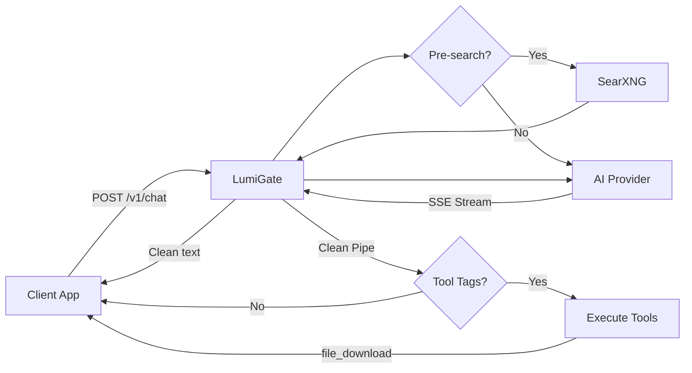

# LumiGate

Self-hosted AI Agent Platform. One endpoint, 8 providers, server-side tool execution, enterprise auth.

## Quick Start

```bash
git clone https://github.com/richardhxwang/lumigate.git && cd lumigate
cp .env.example .env   # add your API keys
docker compose up -d --build
```

Dashboard at `http://localhost:9471`. Chat UI at `http://localhost:9471/lumichat.html`.

## What is LumiGate

LumiGate is a unified AI gateway that sits between your apps and 8 AI providers. Send a single `POST /v1/chat` request — the server handles provider routing, web search, file generation, and tool execution. Clients only receive clean text and download events. No tool logic on the frontend.

Ships with LumiChat, a production chat UI with SSE streaming, PocketBase auth, file attachments, voice input, and dark/light mode.

Runs on a NAS, mini PC, or any Docker host.

## Architecture



<details><summary>Text-based architecture (for renderers without Mermaid support)</summary>

```
┌──────────┐                ┌──────────────────────────────┐
│ LumiChat │──cookie──▶     │        LumiGate Server       │
│ iOS App  │──HMAC────▶     │                              │
│ Any App  │──Token───▶     │  /v1/chat → Auth → AI Proxy  │
└──────────┘                │    → Tool Execute → Clean SSE │
                            └──────┬────────┬────────┬─────┘
                                   │        │        │
                            ┌──────┴──┐ ┌───┴───┐ ┌──┴────────┐
                            │ 8 AI    │ │DocGen │ │PocketBase │
                            │Providers│ │SearXNG│ │(Auth/Data)│
                            └─────────┘ └───────┘ └───────────┘
```

</details>

## API

```bash
curl -N -X POST http://localhost:9471/v1/chat \
  -H "Content-Type: application/json" \
  -H "X-Project-Key: $KEY" \
  -d '{
    "provider": "deepseek",
    "model": "deepseek-chat",
    "messages": [{"role": "user", "content": "Generate Excel: quarterly sales"}],
    "stream": true
  }'
```

SSE response delivers three event types:

| Event | Purpose |
|-------|---------|
| `data` (default) | Clean text chunks — render directly |
| `event: tool_status` | Progress hints (e.g. "Generating Excel...") |
| `event: file_download` | File metadata — render as download card |

Optional fields: `web_search` (bool, auto-detected if omitted), `tools` (bool, default true).

## Providers

| Provider | Auth | Example Models |
|----------|------|----------------|
| OpenAI | API Key | GPT-4.1, o3, o4-mini |
| Anthropic | API Key | Claude Opus 4, Sonnet 4 |
| Gemini | API Key | Gemini 2.5 Flash/Pro |
| DeepSeek | API Key | DeepSeek-Chat, R1 |
| MiniMax | API Key | MiniMax-M1, M2.5 |
| Kimi | Collector | Moonshot |
| Doubao | Collector | ByteDance |
| Qwen | Collector | Tongyi Qwen |

Collector providers use headless Chrome via CDP. Admin logs in once through VNC; Chrome maintains the session.

## Features

### Clean Chat Proxy

Single `POST /v1/chat` endpoint for all providers. Tool tags are intercepted and executed server-side — clients never see them. Works with any model, no native function calling required.

The SSE stream delivers three event types: `data` for clean text chunks (render directly), `tool_status` for progress hints with a fade-in animation and typing dots indicator, and `file_download` for file metadata that the client renders as a download card. Clients only need a standard EventSource — no tool parsing, no provider-specific handling.

### Tool Execution

AI models trigger tools via text tags (`[TOOL:name]{params}[/TOOL]`). The server intercepts, executes, and streams results back as clean events.

Three tag formats are supported: DSML (`[TOOL:...]...[/TOOL]`), XML (`<tool name="...">...</tool>`), and Anthropic native `tool_use` blocks. The server normalizes all formats before execution, so any model can use tools regardless of its native calling convention.

Available tools: `generate_spreadsheet` (Excel with formulas), `generate_document` (Word), `generate_presentation` (PowerPoint), `use_template` (224 professional templates across business, finance, HR, and project management), `web_search`, `parse_file`, `transcribe_audio`, `vision_analyze`, `code_run`.

Tool injection prevention is enforced: user-supplied content is scanned for embedded tool tags to prevent prompt-injection attacks that attempt to trigger unauthorized tool calls.

### Smart Web Search

Contextual web search is integrated into the chat pipeline. When enabled, the server analyzes the user's message and auto-detects whether a search is needed before sending to the AI provider. A configurable keyword model (default: MiniMax for cost efficiency) generates time-aware multi-keyword queries that include the current year for freshness. Results are fetched from a self-hosted SearXNG instance with a default one-month time range (falls back to all-time if too few results), deduplicated, and injected as context into the AI prompt with instructions to prioritize recent results. Auto-search can be toggled on or off per request or globally via the dashboard.

### LumiChat

Built-in chat UI at `/lumichat.html`. SSE streaming with real-time markdown rendering, syntax highlighting, and LaTeX math support. Supports all 8 providers with per-model switching.

Key capabilities: slash commands for quick actions, 10 built-in system presets (Coder, Professional, Translator, etc.) with custom preset support (up to 8), persistent session management with conversation history, mid-stream messaging (new messages queue without aborting the current stream), file attachments with drag-and-drop, voice input via browser speech API, and a rotating tips bar on the welcome screen. PocketBase-backed auth with JWT token refresh, mobile-responsive layout, dark/light theme.

### Security

- **Auth**: HMAC + ephemeral token exchange (key never transmitted). Supports four auth modes — see [Auth Modes](#auth-modes) below.
- **PII detection**: 20+ regex patterns covering emails, phone numbers, SSNs, credit cards, and more. Optional Ollama-based semantic analysis catches patterns that regex alone misses.
- **Secret masking**: Detected secrets are replaced with `[SEC_xxx]` placeholders before reaching the LLM. Original values are restored only when executing tools server-side, so the model never sees raw secrets.
- **Command guard**: 17 rules block dangerous shell commands (rm -rf, curl pipes, reverse shells, etc.) in AI-generated output before they reach tool execution.
- **SSRF protection**: Private IP ranges and internal hostnames are blocked at the DNS resolution layer, preventing tools like `web_search` or `code_run` from accessing internal services.
- **Per-project limits**: RPM rate limiting, daily/monthly budget caps, IP allowlist (up to 50 CIDRs), model allowlist, and anomaly auto-suspend (triggers on 5x traffic spikes).
- **Audit trail**: All security events and API calls are logged to PocketBase collections (`security_events`, `audit_log`) for compliance and forensics.

### MCP Gateway

MCPJungle + Playwright for browser automation and external tool server integration. Enables LumiGate to call external MCP-compatible tool servers and orchestrate browser-based workflows.

## Auth Modes

| Mode | Mechanism | Best For |
|------|-----------|----------|
| Direct Key | `X-Project-Key` header | Server-to-server |
| HMAC Signature | Client signs request; key never transmitted | Mobile apps |
| Ephemeral Token | Short-lived token via `/v1/token` | Session-bound access |
| HMAC + Token | HMAC to exchange, token for requests | **Client apps (recommended)** |

## Deploy Modes

| Mode | Modules | Use Case |
|------|---------|----------|
| Lite | usage, chat, backup | Personal use |
| Enterprise | All 9 modules | Teams, compliance |
| Custom | Pick & choose via `MODULES` env var | Tailored setups |

### Modular Design

LumiGate uses a runtime module system. Each module can be enabled or disabled without restarting — data files are always loaded, modules only gate their endpoints. Hot-switch between modes via the dashboard or API.

| Module | Purpose |
|--------|---------|
| `usage` | Request counting, per-provider/per-model usage tracking, auto-pruning at 365 days |
| `budget` | Per-project spend enforcement with daily or monthly caps in USD |
| `multikey` | Multiple API keys per provider with automatic rotation and failover |
| `users` | User management, approval flow for new registrations, role-based access |
| `audit` | Structured event logging to PocketBase for compliance and forensic review |
| `metrics` | Latency histograms, error rates, provider health scoring |
| `backup` | Scheduled data backup and restore, PocketBase sync for collector tokens |
| `smart` | Intelligent routing — model fallback, cost optimization, load balancing |
| `chat` | LumiChat UI serving and session management |

Use `mod(name)` in code to check if a module is active, or `requireModule(name)` as Express middleware to gate routes.

## Configuration

Most settings are configurable through the Dashboard (Settings page) without editing config files:

| Setting | Description |
|---------|-------------|
| **Search keyword model** | Which provider/model generates search keywords (default: MiniMax for cost efficiency) |
| **Auto search** | Toggle automatic web search detection on or off globally |
| **Tool injection guard** | Enable/disable scanning of user messages for embedded tool tags |
| **SMTP settings** | Configure outbound email for user approval notifications |
| **Approval flow** | Require admin approval for new user registrations before granting access |
| **Deploy mode** | Switch between Lite, Enterprise, and Custom module sets at runtime |

Environment variables (`.env`):

```bash
DEPLOY_MODE=lite                  # lite | enterprise | custom
MODULES=usage,chat,audit          # only used when DEPLOY_MODE=custom
ADMIN_SECRET=your-secret          # dashboard admin password
PB_URL=http://pocketbase:8090     # PocketBase instance URL
CF_TUNNEL_TOKEN_LUMIGATE=...      # Cloudflare tunnel token (optional)
```

## Collector Providers

Kimi, Doubao, and Qwen do not offer standard API key access. LumiGate uses a Collector approach to proxy these providers:

- **Headless Chrome via CDP**: A Chrome instance runs alongside LumiGate, controlled through the Chrome DevTools Protocol. Requests are forwarded as if from a logged-in browser session.
- **Cookie persistence**: Authentication cookies are saved to disk and survive container restarts. No need to re-login after a reboot.
- **Auto re-login flow**: If a session expires, the admin is prompted to log in again through a VNC-accessible browser window. Once authenticated, the new cookies are captured and persisted automatically.
- **Session sharing**: A single authenticated session is shared across all projects and users. Collector tokens are backed up to PocketBase for redundancy.

Collector providers appear in the Providers table on the dashboard with a distinct status indicator showing session health.

## License

MIT
